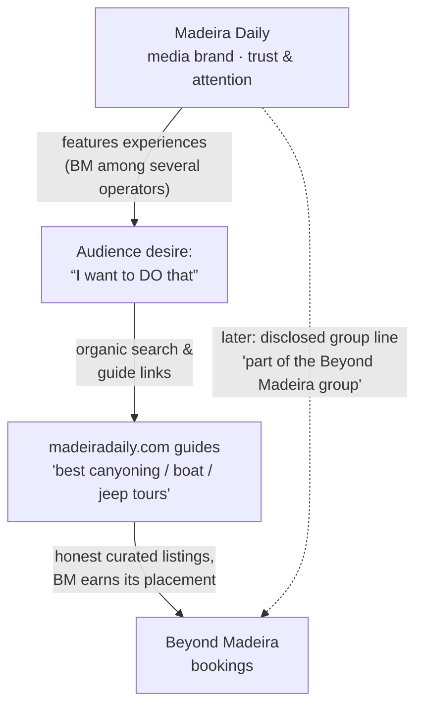
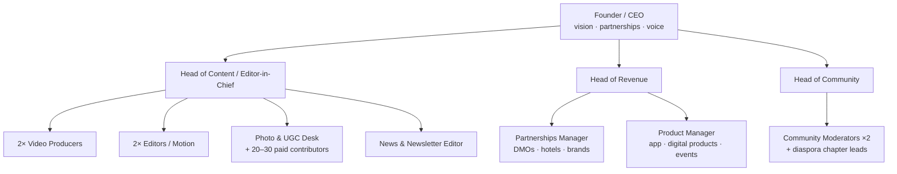
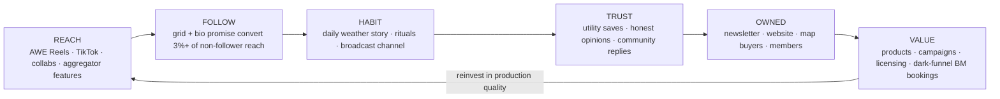

# MADEIRA DAILY — The Media Brand Blueprint

**A complete startup plan for building the biggest Madeira-focused media brand on social media.**

*Prepared for the founder of Beyond Madeira · July 2026 · Confidential working document*

---

## Table of Contents

0. [Executive Summary & Assumption Challenges](#0-executive-summary--assumption-challenges)
1. [Brand Positioning](#1-brand-positioning)
2. [Brand Identity](#2-brand-identity)
3. [Content Strategy — 58 Content Pillars](#3-content-strategy)
4. [Viral Strategy — The Psychology of Every Action](#4-viral-strategy)
5. [Instagram Strategy](#5-instagram-strategy)
6. [Growth Engine — 1k to 1M](#6-growth-engine)
7. [Monetization Without Ruining Trust](#7-monetization)
8. [Relationship with Beyond Madeira](#8-relationship-with-beyond-madeira)
9. [Competitive Analysis](#9-competitive-analysis)
10. [5-Year Vision](#10-5-year-vision)
11. [12-Month Execution Roadmap](#11-execution-plan)
12. [SWOT, Funnels, Frameworks & Checklists](#12-swot-funnels-frameworks--checklists)

---

# 0. Executive Summary & Assumption Challenges

You asked for a strategy to build "Madeira Daily" — the biggest Madeira media brand on social media, deliberately disconnected from Beyond Madeira, with content quality (not sales) as the engine of growth. That instinct is correct and it is the single most important strategic decision in this document: **media brands compound; ad accounts don't.** Beautiful Destinations, Secret London and Pubity all became valuable precisely because for years they optimized for one metric only — *"is this the best thing this person will see today?"*

Before the full plan, I'm going to challenge four of your assumptions, because you asked me to and because getting these wrong is expensive:

### Challenge #1 — The name: "Madeira Daily" (pressure-tested; founder decision = keep it)

**Founder decision: the brand is "Madeira Daily."** The handle is registered and the daily cadence is a commitment the founder is happy to own. A name is 5% of the outcome and execution is the rest — but the name was pressure-tested, its weaknesses are real, and each one gets a designed mitigation instead of a shrug:

1. **"Daily" is a promise of frequency, not a positioning.** Weakness → weapon: the name is now a public contract. Never miss a day — ever — and the promise *becomes* the positioning: **the island's daily briefing**, the page people check like the weather. The habit-forming rituals in Section 5 stop being tactics and become the brand itself.
2. **The name carries no search hook.** Nobody searches "Madeira daily"; huge volumes search *"Madeira hidden gems"* and *"secret places Madeira"*. Mitigation: recover that intent through the searchable Instagram *name field* ("Madeira Daily | Hidden Gems, Hikes & News"), keyword-first captions, and a named weekly franchise — **"Hidden Madeira"** — that lives *inside* the page as its hidden-gems series. The franchise does the SEO work the brand name can't.
3. **It doesn't differentiate from Visit Madeira by itself.** A "daily feed of pretty pictures" is what the tourism board already does. Mitigation: differentiation must come entirely from voice, opinion and utility (Sections 1–2) — the "skip this, go here instead" honesty an official body can never publish.

One warning stands regardless: do **not** drift toward "Secret Madeira" for any sub-brand — the "Secret [City]" family (Secret London, Secret NYC) is owned and trademarked by Fever's Secret Media Network, and borrowing it invites a legal fight. Full scoring analysis of all candidate names is preserved in Section 2.

### Challenge #2 — Total secrecy about the Beyond Madeira connection is illegal at the point where it matters

Building the media brand as an editorially independent, unbranded page: **completely fine and correct.** But the moment the page starts driving traffic to Beyond Madeira tours *while hiding the ownership*, you cross from strategy into undisclosed advertising — which violates EU consumer protection law (Unfair Commercial Practices Directive), Portugal's implementation of it, and Instagram's branded-content policies. Regulators and, more dangerously, *Reddit threads* have destroyed media brands over exactly this.

The good news: **you don't need secrecy — you need sequencing.** Stay unconnected during the growth phase (months 0–12) when there's nothing to disclose because you're not selling anything. When commercial integration begins, use the "media group" disclosure model (Section 8): a single quiet line — *"Madeira Daily is part of the Beyond Madeira group"* — in the bio/website footer satisfies the law, and audiences demonstrably don't care as long as the editorial content stays honest (Secret London openly belongs to Fever, a ticketing company, and it never slowed them down; if anything it professionalized them). Trust dies from *hidden* incentives being exposed, not from *known* incentives existing.

### Challenge #3 — Instagram-first, yes. Instagram-only, no.

Agreed that Instagram is the flagship (travel discovery lives there). But the MrBeast lesson is that distribution is multi-surface and content is made once, formatted many times. From day one, every Reel ships natively to TikTok and YouTube Shorts (60 extra seconds of work, 2–3x total reach, and TikTok/Shorts are where you'll find viral outliers that you then double down on for Instagram). Facebook matters more than you think for Madeira specifically: the Madeiran diaspora (UK, Jersey, South Africa, Venezuela, USA — millions of people with emotional ties to the island) skews older and lives on Facebook. Diaspora nostalgia content is a growth cheat code no competitor is using (Section 3, Pillar group C).

### Challenge #4 — "The objective is not to sell" needs one refinement

Correct for the audience-facing brand. But internally, define the objective precisely or you'll drift: **the objective is to own attention and trust in the "Madeira" niche — measured in reach, saves, and email addresses — because attention and trust are the asset every future revenue stream (including Beyond Madeira bookings) is built on.** "Not selling" is the tactic; *owning the niche* is the objective. Pubity didn't avoid monetization forever — it delayed monetization until the audience was too big to lose.

### The one-paragraph plan

Launch **Madeira Daily**, an insider-eye media brand ("the island the postcards don't show you"), publishing 1–2 Reels per day plus 2–3 save-optimized carousels per week across a 6-bucket content system (Awe, Utility, Identity, Timely, Nature, Interactive — 58 pillars). Grow via short-loop cinematic Reels + saveable guides + diaspora nostalgia + local UGC licensing, cross-posted to TikTok/Shorts/Facebook. Monetize nothing for 6 months; then layer in media licensing, affiliate, a paid map/guide product, a newsletter, and eventually tourism-board and hotel partnerships — with sponsorships capped and labeled. Beyond Madeira benefits through the "dark funnel": featured organically as one of several operators, then formalized as a disclosed group company once the media brand has independent gravity. Targets: 10k followers by month 3, 50k by month 6, 250k by month 12, 1M within 24–30 months, with revenue beginning month 7 and reaching €3–5k/month by month 12 — independent of any Beyond Madeira booking uplift.

---

# 1. Brand Positioning

## 1.1 Mission

> **Show the world the Madeira that postcards, brochures and tourism boards can't — one incredible piece of content at a time.**

Internal version (what the team optimizes for): *Be the best thing a person sees on their feed today. Every post must earn its place.*

## 1.2 Vision

> **Become the definitive media voice of Madeira — the page every traveler follows before they arrive, every local checks daily, and every Madeiran abroad follows to feel home.**

By year 5: the largest Madeira-focused audience in the world across every platform, a media company with its own products, and the brand global media call when they need anything about Madeira.

## 1.3 Brand Personality

Think of the brand as a person. If Visit Madeira is the polished tourism-board spokesperson reading from a script, Madeira Daily is:

**The local friend with a drone.** Someone who grew up on the island, knows the fisherman in Câmara de Lobos by name, knows which levada to hike when it rains in Funchal but the sun is out in Calheta, and films it all beautifully — not to impress you, but because they genuinely can't believe they get to live here.

| Personality dimension | Madeira Daily is… | Madeira Daily is not… |
|---|---|---|
| Attitude | In love with the island, slightly obsessive | Salesy, promotional, "book now" |
| Knowledge | Insider, specific, precise ("park at the second bend after Boca da Corrida") | Vague, generic ("this stunning paradise!") |
| Humor | Dry, self-aware, occasionally teases tourists *and* locals | Cringe, meme-spam, mean |
| Voice | First person plural — "we", the collective voice of people who love this island | Corporate third person |
| Honesty | Tells you when a spot is overrated, when it's crowded, when the weather ruins a plan | Relentlessly positive propaganda |

That last row is the trust engine. **The willingness to say "skip this, it's overrated — go here instead" is what a tourism board can never do,** and it's worth more followers than any drone shot.

## 1.4 Target Audience

Four concentric audiences, in priority order:

**A. The Dreamer-Planner (primary, ~60% of audience at scale).** 25–45, European core (UK, Germany, France, Netherlands, Poland, Scandinavia) plus growing US. Found Madeira through a viral Reel or a friend's trip. In the 2-week-to-12-month window between "I want to go" and "I booked." Behavior: saves obsessively, sends posts to their travel partner ("us?"), follows 5–10 destination pages. **This person's *save* and *send* are your growth engine.**

**B. The Madeiran Diaspora (secret weapon, ~15%).** Hundreds of thousands of Madeirans and descendants in the UK, Jersey, South Africa, Venezuela, USA and Brazil. Deep emotional connection, extreme engagement on nostalgia content (old photos, festas, villages, food), and they *share aggressively* to family groups. No competitor targets them. They also defend the page in comments — free community management.

**C. Locals & residents (~15%).** They follow for news, weather drama, pride, and to judge whether you got it right. Their comments ("actually, that's Fajã dos Padres, and my grandfather…") are engagement gold and your credibility layer. A Madeira page locals sneer at will never be the biggest; a page locals adopt becomes an institution.

**D. The Global Awe-Scroller (~10%, but they drive reach spikes).** Doesn't know where Madeira is, doesn't care, just watched your wave-crashing-over-a-pool Reel 3 times. They're the Pubity audience: they convert to followers at low rates but they carry your content into the algorithm's outer orbit, where the Dreamer-Planners get exposed to you.

## 1.5 Why follow Madeira Daily instead of Visit Madeira?

| Dimension | Visit Madeira (tourism board) | Madeira Daily |
|---|---|---|
| Incentive | Must promote everything, offend no one | Can have opinions, rank things, say "skip it" |
| Content ceiling | Polished, safe, committee-approved | Raw, timely, emotional, occasionally chaotic (storm footage at 7am) |
| Specificity | "Discover our levadas!" | "Levada do Alecrim: 3.5h, park here, go before 9am, bring a headlamp for the tunnel" |
| Speed | Campaign cycles | Posted the rainbow 20 minutes after it appeared |
| Voice | Institution | Friend |
| Locals' relationship | Ignore it | Argue in the comments, send tips via DM |

One sentence: **people follow Visit Madeira the way they read a brochure; people will follow Madeira Daily the way they text a friend who lives there.**

---

# 2. Brand Identity

## 2.1 Name Analysis

Scoring criteria (1–5 each): **Differentiation** (vs. Visit Madeira & generic pages), **Search/SEO hook** (does it match real search intent?), **Emotional pull**, **Scalability** (works at 1M followers, works for a media company, works beyond Instagram), **Legal/handle risk** (5 = safe). The analysis is preserved here as the record behind the decision:

| Name | Diff. | SEO | Emotion | Scale | Risk | Total | Verdict |
|---|---|---|---|---|---|---|---|
| **Madeira Daily** | 1 | 1 | 1 | 3 | 4 | 10 | ✅ **Founder's choice** — weak on paper, fully workable with the playbook below |
| Hidden Madeira | 5 | 5 | 4 | 5 | 4 | **23** | Top score — declined as brand name; reused as the in-page hidden-gems franchise |
| Madeira Untold | 5 | 3 | 5 | 5 | 5 | 23 | In reserve — strong future sub-brand for the documentary arm |
| Raw Madeira | 4 | 2 | 5 | 4 | 4 | 19 | Good for a video-heavy sub-brand later |
| Secret Madeira | 5 | 5 | 4 | 4 | **1** | 19 | ❌ Fever/Secret Media Network trademark family — legal risk + reads as a clone |
| Madeira Insider | 3 | 3 | 3 | 4 | 3 | 16 | Fine but flat; "insider" is overused |
| The Madeira Collective | 3 | 1 | 3 | 4 | 4 | 15 | Agency energy, not media energy |
| Beyond the Rock / Ilha | 4 | 1 | 4 | 3 | 2 | 14 | ❌ "Beyond" collides with Beyond Madeira — defeats separation |

**Making "Madeira Daily" win — the five moves:**

1. **Keep the promise literally.** 365 posts a year, zero gaps. The name audits you in public; a "Daily" page that goes quiet for four days reads as abandoned. Bank a two-week emergency content buffer at all times so illness, weather or travel never breaks the streak.
2. **Own "daily" as habit infrastructure.** Lean the positioning into the name: the morning weather + trail-status story, the fixed weekly rituals, the "what's happening on the island today" layer. "Daily" is a weak *discovery* name but a strong *retention* name — so win retention harder than anyone.
3. **Run "Hidden Madeira" as the flagship weekly franchise.** A named, visually distinct hidden-gems series (own cover style, own title card) inside the page. It captures the "hidden gems Madeira" search demand, gives the page its discovery edge, and stays ownable as a future product line (the map, the guides).
4. **Recover SEO in the metadata.** Instagram name field: "Madeira Daily | Hidden Gems, Hikes & News". Every caption opens with the searched phrase, not the brand name. Spoken keywords in Reels. The name won't pull search traffic, so the content must.
5. **Defensive registrations.** Trademark "Madeira Daily" (EU word mark, classes 35/38/41, ~€850) within the first 90 days — before the name is worth stealing. Also quietly register `@hiddenmadeira` and `hiddenmadeira.com` anyway: it blocks the obvious copycat name and later hosts the franchise.

Handle strategy: you hold `@madeiradaily` on Instagram — now secure the same handle on TikTok, YouTube, Facebook, X/Threads, plus `madeiradaily.com` and `.pt` **before anything else in this plan**. Squatters move within weeks of a page showing traction.

Language decision (this matters as much as the name): **English-first, Portuguese-flavored.** All captions in English (the global growth language; UK/DE/NL/US are your growth markets), but deliberately seasoned with Portuguese/Madeiran words left untranslated — *poncha, levada, festa, saudade* — with occasional bilingual posts for local/diaspora moments. This is exactly how you serve audiences A, B, C and D simultaneously.

## 2.2 Logo Direction

The logo must survive three environments: a 40px Instagram avatar, a watermark on video, and a media kit sent to a tourism board.

- **Primary mark:** a custom wordmark — "MADEIRA" dominant, "DAILY" small and letterspaced beneath it (the newspaper-masthead logic: the place is the story, "daily" is the promise) — with one distinctive detail: the "A"s cut at an angle echoing the island's cliff profile, or a subtle wave/contour line through the M. No clip-art islands, no palm trees, no compasses (instant amateur signal).
- **Avatar mark:** an "HM" monogram or a minimal glyph of the island's unmistakable silhouette (Madeira's outline is genuinely iconic — a lying shark shape) inside a solid circle. Test at 40px: if you can't recognize it, simplify.
- **Watermark:** small, corner-placed, ~40% opacity wordmark on every video. Non-negotiable from post #1 — your best clips *will* be stolen by aggregators, and the watermark converts theft into distribution (this is how EarthPix-style pages absorbed audience from their own stolen content).

## 2.3 Colour Palette

Steal from the island itself, not from travel-brand clichés (no coral/turquoise Canva palette):

| Role | Colour | Hex | Source |
|---|---|---|---|
| Primary dark | Basalt Black | `#101418` | Volcanic rock, dramatic base for text/frames |
| Primary accent | Laurisilva Green | `#1E5B3A` | The UNESCO forest — deep, not lime |
| Secondary accent | Atlantic Teal | `#155E75` | Deep sea, not swimming-pool blue |
| Warm accent | Poncha Gold | `#E0A63C` | Sunset light, poncha, festa lights — used sparingly for highlights/CTAs |
| Neutral light | Sea-Mist White | `#F4F2ED` | Backgrounds, captions on carousels |

Rule: photography and video are never colour-graded to match the brand (authenticity > consistency in the imagery itself); the brand colours live in **typography, carousel frames, map graphics, story templates and the logo.** That's how Daily Overview and Beautiful Destinations feel consistent without filtering reality.

## 2.4 Typography

- **Display (carousel covers, titles):** a confident grotesque with character — e.g. *General Sans*, *Clash Grotesk* or *Archivo Expanded*. All-caps, tight tracking for headlines. This gives "media company", not "travel blog".
- **Body (carousel text, infographics):** *Inter* or *Söhne*-style neutral sans, high legibility at small sizes.
- **Accent (rare):** a serif italic (*Editorial New*-style) reserved for portrait/story quotes and the Humans-of-Madeira series — the typographic signal that "this one is about a person."
- On-video text: one style only, forever — white, subtle shadow, same font, same position. Viewers should recognize a Madeira Daily Reel with the sound off and the handle cropped out.

## 2.5 Visual Language

Seven rules, printed above the editing desk:

1. **Motion over stills** for reach; **stills and carousels** for saves. Both, always.
2. **The first frame is the thumbnail is the hook.** Never open on a logo, a title card, or a slow establishing shot.
3. **Scale contrast** — a tiny human in a giant landscape — is the single most reliably viral composition in this niche. Hunt for it deliberately.
4. **Weather is content.** Fog, storms, cloud inversions, rainbows, the "above the clouds" shot at Pico do Areeiro. Visit Madeira posts sunshine; you post *drama*.
5. **Real texture:** hands, salt, rust, wet stone, market noise. One raw, imperfect clip per week outperforms polish and builds the "this is real" trust.
6. **Consistent grade, not a filter:** slightly lifted blacks, natural greens (never neon), warm highlights. Build 3 custom LUTs (sunny / fog / golden hour) and use nothing else.
7. **Every graphic (map, infographic, before/after) uses the brand frame system** — same margins, same title placement, same palette — so screenshots of your content are branded even without the watermark.

## 2.6 Tone of Voice

The written voice in one line: **a sharp local friend who respects your time.**

| Situation | ❌ Generic travel page | ✅ Madeira Daily |
|---|---|---|
| Caption for a viewpoint | "Paradise found! 😍🌴 Tag someone you'd bring here!" | "Véu da Noiva. 9 out of 10 cars drive past the unsigned lower platform. Coordinates in comments — go before 9am or share it with four tour buses." |
| Weather drama | "Mother nature showing off!" | "Porto Moniz this morning. The pools are closed. The show is not." |
| Correcting a myth | — | "'Madeira is for old people.' Madeira has 30 canyoning routes, a world-class trail-running circuit and paragliding off a 580m cliff. The rumour survives because the people who know better are busy." |
| A mistake | (delete comment) | "You're right — that's Ponta do Sol, not Madalena do Mar. Fixed. This is why we love local followers." |

Voice rules: short sentences; specifics beat adjectives; numbers beat superlatives; never beg ("like & share!"); one emoji maximum and usually zero; admit errors fast and publicly; Portuguese words unitalicized and unexplained when context carries them (respect makes locals share).

---

# 3. Content Strategy

## 3.1 The 6-Bucket System

Every piece of content belongs to one of six buckets, each with a *job* and a *primary metric*. This is how you stop guessing "what should we post" and start operating a machine:

| Bucket | Job | Primary metric | Share of output |
|---|---|---|---|
| **A — AWE** | Reach new people via the algorithm | Shares, watch time, non-follower reach | 35% |
| **B — UTILITY** | Convert viewers into followers & savers | Saves, follows per reach | 25% |
| **C — IDENTITY & CULTURE** | Build love, depth, diaspora loyalty | Comments, shares to DMs, profile visits | 15% |
| **D — TIMELY** | Make the page a *habit* ("what's happening?") | Story views, return frequency | 10% |
| **E — NATURE & WILDLIFE** | Awe + education, PR-friendly authority | Shares, media pickups | 7% |
| **F — INTERACTIVE & FORMATS** | Manufacture comments and community | Comments, poll taps, UGC submissions | 8% |

## 3.2 The 58 Content Pillars

### Bucket A — AWE (reach engines)

| # | Pillar | Format | Notes |
|---|---|---|---|
| 1 | Drone cinematics of the coastline | Reel 6–12s loop | The workhorse. One "impossible" angle per week. |
| 2 | Above-the-clouds at Pico do Areeiro / Pico Ruivo | Reel + photo | The island's signature shot; infinitely repeatable across seasons. |
| 3 | Storm & wave power (Porto Moniz, Paul do Mar, Seixal) | Reel, raw audio | Weather drama = global reach. Post within hours of the event. |
| 4 | Sunrise/sunset timelapses | Reel | Pair with one-line poetic caption; huge save rates. |
| 5 | Waterfall spectacle (25 Fontes, Anjos waterfall over the road) | POV Reel | Cascata dos Anjos "car wash" waterfall is a guaranteed viral format. |
| 6 | Levada tunnel POV with headlamp | POV Reel | Claustrophobic → payoff reveal structure. |
| 7 | Infinity pools & natural pools from above | Drone Reel | Scale-contrast composition (tiny swimmer). |
| 8 | Fog rolling over Fanal forest | Reel | Fanal in fog is the most cinematic location on the island; own it. |
| 9 | Astro / Milky Way / star trails | Photo + BTS Reel | Rare content nobody local does consistently. |
| 10 | The famous Madeira airport landing | Reel | Planespotting + crosswind landings = a viral genre of its own. |
| 11 | Cliff scale shots (Cabo Girão skywalk, Ponta de São Lourenço) | Reel/photo | Vertigo content shares itself. |
| 12 | Seasonal transformations (same spot, 4 seasons / snow on the peaks) | Split-screen Reel | "Madeira has SNOW?" is a reliable shock hook. |

### Bucket B — UTILITY (save engines)

| # | Pillar | Format | Notes |
|---|---|---|---|
| 13 | Itineraries (3-day, 5-day, 7-day, first-timer) | Carousel + map | The single highest-save format in travel. Refresh quarterly. |
| 14 | Hike guides with stats (distance, time, parking, difficulty) | Carousel | One levada/trail per week = 52 evergreen assets/year. |
| 15 | "How to get to X" logistics | Reel + pinned comment | Answers the #1 DM question preemptively. |
| 16 | Best-time-to-visit guides (by month, by activity) | Carousel | Evergreen SEO magnet. |
| 17 | Rain-day plans by region | Carousel | Microclimate island = unique utility no generic page can offer. |
| 18 | Budget breakdowns ("Madeira on €60/day") | Carousel | Cost content is saved AND argued about (comments). |
| 19 | Sunrise/sunset spot maps | Map graphic | Branded map template; screenshot-proof. |
| 20 | Driving routes & road-trip loops | Reel + carousel | Include the scary-road disclaimers; drama + utility. |
| 21 | Food guides (poncha, espetada, bolo do caco, lapas, where locals eat) | Carousel + Reel | Restaurant specificity builds insider credibility. |
| 22 | Hidden beaches & natural pools list | Carousel | The name-defining format: "5 beaches tourists never find." |
| 23 | Viewpoint (miradouro) rankings | Carousel | Rankings generate comment wars — utility + engagement. |
| 24 | Porto Santo complete guide | Carousel series | The "second island" angle; underserved niche. |
| 25 | Packing & microclimate explainer ("4 seasons in one day") | Reel | Extremely shareable to travel partners. |
| 26 | Where to stay by vibe (surf / luxury / hiking / quiet) | Carousel | Later becomes a monetization asset (Section 7). |
| 27 | Accessibility & family guides (Madeira with kids, with limited mobility) | Carousel | Underserved audience, high loyalty, high shares in niche groups. |
| 28 | Common tourist mistakes ("7 mistakes first-timers make") | Reel | Negative framing outperforms; saves + sends. |

### Bucket C — IDENTITY & CULTURE (love engines)

| # | Pillar | Format | Notes |
|---|---|---|---|
| 29 | Humans of Madeira — portraits & micro-stories | Photo + long caption | The HONY playbook: fisherman, embroiderer, the Monte sled drivers (carreiros), the last farmer on a fajã. Weekly series. |
| 30 | Festas & traditions calendar (arraiais, religious feasts) | Reel + story | Diaspora catnip; locals share to family groups. |
| 31 | Madeira wine — history, cellars, why it survives 200 years | Carousel/Reel | Premium topic, attracts an affluent audience segment. |
| 32 | Madeiran words & expressions locals actually use | Reel/carousel | Language content = identity content = shares. |
| 33 | Then/Now — old photos vs. today, same angle | Split carousel | Historic Funchal photos re-shot precisely; nostalgia engine. |
| 34 | Diaspora stories ("Madeirans of London/Jersey/Caracas/Cape Town") | Portrait series | Nobody does this. Massive untapped emotional territory. |
| 35 | Village spotlights (one village, its story, its característica) | Mini-doc Reel | 40+ villages = 40+ episodes of an ownable series. |
| 36 | Crafts & disappearing professions (wicker, embroidery, boat building) | Mini-doc | PR-friendly; tourism boards and museums will amplify. |
| 37 | CR7 & football culture moments | Reactive Reel | Use sparingly and cleverly — borrowed reach from the island's most famous export. |
| 38 | Grandma's recipes / home cooking | Reel series | Food + family + tradition = triple emotional trigger. |
| 39 | The story of the levadas (who built them, at what cost) | Explainer carousel | Deep history behind the island's most famous feature. |

### Bucket D — TIMELY (habit engines)

| # | Pillar | Format | Notes |
|---|---|---|---|
| 40 | Weather events — snow on the peaks, capacete fog, heatwaves, rainbows | Story-first, best clips to Reel | Speed is the moat: be first, every time. |
| 41 | Event coverage — Flower Festival, Carnival, Wine Fest, Monte fireworks | Reel + story takeover | Own the event-coverage niche locals currently get from fragmented sources. |
| 42 | NYE Atlantic fireworks (former Guinness record) | Planned mega-production | One flagship production per year; December's anchor content. |
| 43 | New openings — restaurants, hotels, viewpoints, trails reopening | Story + Reel | "First look" positioning; sources come to you as you grow. |
| 44 | Flight routes & travel-deal news | Story + graphic | "New direct route from NYC" news travels far; tag airline/airport. |
| 45 | Trail & levada status updates (closures, conditions) | Story highlight | Pure service; makes the page infrastructure, not entertainment. |
| 46 | Cruise ship & harbour happenings | Story | Funchal harbour drama (big ships, tall ships) is reliable local interest. |

### Bucket E — NATURE & WILDLIFE (authority engines)

| # | Pillar | Format | Notes |
|---|---|---|---|
| 47 | Whales & dolphins (28+ species pass Madeira) | Reel | Partner with marine biologists/operators for footage & credibility. |
| 48 | Monk seals of the Desertas — one of Earth's rarest seals | Mini-doc | Conservation story with genuine global-media potential. |
| 49 | Zino's petrel & endemic birds | Explainer | "The rarest seabird in Europe nests on ONE mountain ridge — this one." |
| 50 | The Laurisilva — a 20-million-year-old UNESCO forest | Explainer series | Your deepest authority topic; evergreen, licensable. |
| 51 | Endemic flowers & the garden-island story | Photo series | Older + affluent audience segment; Facebook gold. |
| 52 | Underwater Madeira (Garajau reserve, groupers, mantas) | Reel | Partner with dive schools; content nobody surface-level makes. |

### Bucket F — INTERACTIVE & FORMATS (comment engines)

| # | Pillar | Format | Notes |
|---|---|---|---|
| 53 | Guess the location | Story + Reel | The most reliable comment machine in geo-media. Weekly ritual (same day, always). |
| 54 | This-or-that battles (north vs. south, poncha vs. nikita, best miradouro bracket) | Poll + carousel | Manufactured rivalry = manufactured comments. Run an annual "best of Madeira" bracket tournament. |
| 55 | UGC features ("Shot by you") | Weekly repost with credit | Your content pipeline AND community flywheel (Section 6). |
| 56 | Myth-busting ("Madeira is only for old people", "there are no beaches") | Reel | Controversy-lite: locals defend, tourists learn, everyone comments. |
| 57 | "What €100 gets you in Madeira" cost reveals | Reel | Price transparency content is saved, shared, and argued with. |
| 58 | AI-era explainers — maps, animated "how levadas work", "why Madeira has 4 microclimates", "how the island was formed" | Animated infographic Reel | Daily-Overview-style intelligence content; differentiates from pure-pretty pages. |

## 3.3 Weekly Content Rhythm (launch phase)

| Day | Slot 1 (Reel, ~18:00 WET) | Slot 2 |
|---|---|---|
| Mon | AWE — drone/landscape loop | Story: week's weather + trail status |
| Tue | UTILITY — hike guide carousel | Story: behind the scenes |
| Wed | AWE or TIMELY — whatever is hottest | Story: Guess the Location (ritual) |
| Thu | UTILITY/FOOD — restaurant or food Reel | Story: poll (this-or-that) |
| Fri | IDENTITY — Humans of Madeira / culture | Story: UGC submissions review |
| Sat | AWE — the week's best production | Carousel: itinerary/list (weekend planners are browsing) |
| Sun | INTERACTIVE — UGC feature "Shot by you" | Story: next week teaser + question box |

Production batching: **one field day per week produces 2 locations × 4–6 clips = 8–12 Reels of raw material.** Two field days plus archive/UGC covers 10+ posts/week comfortably. Everything is shot vertical-first, edited in CapCut/Premiere with the 3 brand LUTs, capped and exported same-day.

## 3.4 The Hook Library (first 1.5 seconds)

Every Reel opens with one of these proven hook classes — decide the hook *before* shooting:

1. **Shock-scale:** the wave, the cliff, the drop. No text needed.
2. **Forbidden knowledge:** "Locals didn't want me to post this place."
3. **Negative promise:** "Don't hike 25 Fontes. (Do this one instead.)"
4. **Impossible fact:** "This forest is older than the Alps."
5. **POV transportation:** "POV: it's 6:40am and you're above the clouds."
6. **The reveal:** dark tunnel → light → payoff (never show the payoff first).
7. **Price shock:** "This ocean-view lunch cost €9."
8. **The correction:** "Everything you know about Madeira is wrong."

---

# 4. Viral Strategy — The Psychology of Every Action

Instagram's algorithm in 2026 weights, roughly in order for Reels reach: **shares (sends per reach), watch time / completion & replays, likes-per-reach, saves, comments.** Saves and follows-per-reach dominate for *audience building*. So we engineer content for four specific human actions. Here is the psychology of each, and the design rule it produces.

## 4.1 Why people SHARE (the reach lever)

Sharing is almost never about the content — it's about the *sender*. People share to:

1. **Buy social currency** (Jonah Berger's core finding): sending something remarkable makes *me* remarkable. → Design rule: every AWE post should pass the test *"would sending this make someone look good?"* Extraordinary > pretty. A nice beach fails; a wave exploding over a natural pool while someone calmly swims passes.
2. **Say something they can't say themselves.** The #1 share in travel is a Reel sent to a partner with zero words, meaning *"let's go here."* The content is a proposal proxy. → Design rule: make posts that function as complete messages. Caption endings like "Send this to the person you'd watch this sunrise with" work not because they command, but because they *license* an emotion the viewer already had. Use sparingly — one explicit prompt per week maximum, or it reads as begging.
3. **Practical altruism:** "you NEED this for your trip." → Utility carousels get shared into group chats planning trips — the highest-intent distribution on earth.
4. **High-arousal emotion travels; low-arousal doesn't.** Awe, amazement, amusement and even anxiety (storm footage) get shared; "nice" and "calm" get a like and die. → Design rule: if the honest reaction is "that's nice," don't post it to the feed. Stories exist for "nice."
5. **Identity broadcasting (diaspora mechanic):** a Madeiran in Jersey sharing your festa video is telling their network *this is who I am.* → Design rule: culture content must be accurate and dignified — it's being shared as a self-portrait.

## 4.2 Why people COMMENT (the community lever)

Comments are effortful; people only comment when a post activates one of these:

1. **Identity assertion:** locals correcting, confirming, or adding to your post ("my grandfather built that levada"). → Design rule: leave *deliberate space* for local expertise. Ask "what did we miss?" Publish rankings (rankings are wrong to somebody by definition — that's the point).
2. **Tribal rivalry:** north vs. south, Funchal vs. everywhere, best poncha. Low-stakes, high-passion. → The this-or-that pillar exists purely to harvest this.
3. **The completion urge:** guess-the-location, quizzes, "name this beach without saying its name." Open loops demand closing; it's near-compulsive.
4. **Being early / being seen:** at scale, commenting on a big page is performance. Reply to comments *fast and wittily* in the first hour — a page that answers back trains people to perform in your comments. Pin the best reply.
5. **Emotional overflow:** HONY-style human stories produce comments because a like feels insultingly small for what the person just felt. → Bucket C is your deep-comment engine.
6. **Helpful correction (embrace it):** small imprecisions get corrected publicly, which the algorithm reads as engagement. Never manufacture errors — but when they happen, thank loudly and fix. The *culture* of "this page listens" multiplies future comments.

## 4.3 Why people SAVE (the follow-predictor)

A save is a message to one's future self. It happens when content has **future utility exceeding present consumption**:

1. **The trip-planning save:** itineraries, hike stats, food lists, maps. The viewer is *pre-committing* to a future in which they need this. This is also why saves are your most commercially precious metric — a saver is a future visitor.
2. **The reference save:** "best time to visit by month," packing guides — content too dense to absorb now. → Design rule: make carousels *slightly* too information-rich to read in one pass. Density drives saves; a carousel you fully absorb in 15 seconds gets a like instead.
3. **The aspiration save:** mood-board behavior — saving the dream. Even AWE content should carry one line of savable specificity ("Miradouro do Guindaste, 20 min east of Santana") to convert aspiration-savers.
4. **Explicit save-framing works:** titles like "Save this for your Madeira trip" measurably lift saves — because they *reframe the content as an asset*, not because people obey. Use on utility posts only.

## 4.4 Why people FOLLOW (the compounding lever)

A follow is a *subscription decision*, made in about 3 seconds on your profile after one great post. Four conditions must all be true:

1. **Expected future value:** "if this post was this good, the next 100 will be too." The single viral Reel doesn't cause the follow — the *grid behind it* does. → Design rule: your last 9 posts are your landing page. Never let 3 weak posts sit on top of the grid; the profile must always answer "yes" to *"will my feed be better with this in it?"*
2. **Coherent promise:** the bio + name + grid must state one clear promise in a glance. Bio formula: `Your daily dose of the real Madeira 🌊 Hidden spots · hikes · island news | 📍 posted from the island`. A confused profile leaks 30–50% of would-be followers.
3. **Niche authority + consistency:** humans follow *the* page for a topic, not *a* page. Every growth tactic in Section 6 is really about becoming the default answer to "who do I follow for Madeira?"
4. **Identity fit:** following is public self-definition ("I'm the kind of person who dreams about Atlantic islands"). The brand aesthetic (Section 2) is doing silent work here: people follow pages they'd be proud to be seen following.

**The full-funnel design rule that ties it together:** AWE gets you *seen* (shares), UTILITY gets you *kept* (saves), IDENTITY gets you *loved* (comments), and the coherent grid converts all three into *follows*. A page that only does one of these plateaus; the 6-bucket mix is the viral strategy.

---

# 5. Instagram Strategy

## 5.1 Posting Frequency

| Phase | Reels | Carousels | Photos | Stories | Notes |
|---|---|---|---|---|---|
| Months 1–3 | 5–7/week | 2/week | 1/week | 3–5 frames/day | Consistency > volume. Never sacrifice quality for cadence. |
| Months 4–8 | 7–10/week | 3/week | 1–2/week | 5–8/day | Add second daily slot when a UGC/licensing pipeline exists. |
| Months 9+ | 10–14/week | 3–4/week | 2/week | 8–12/day | Pubity-style cadence, only once a content engine (team/UGC) supports it. |

Timing: evenings 18:00–21:00 WET catch both European prime time and the late-afternoon US East Coast; mornings 07:30–08:30 for weather/timely. But **timing is worth 5%; the hook is worth 95%** — don't ritualize the clock.

## 5.2 Reel Length — the two-speed system

- **Loops (6–12 seconds), ~60% of Reels:** built to be watched 2–4 times before the viewer realizes it looped. Replays multiply "watch time per viewer," the strongest reach signal. Perfect for AWE content. Engineering trick: cut the loop so the last frame flows into the first (wave recedes → wave builds).
- **Stories (25–45 seconds), ~35%:** mini-documentaries, POV hikes, Humans of Madeira, explainers. These build *depth* — followers gained here are stickier. Retention curve matters more than length: hook by 1.5s, re-hook (new scene/beat/text) every 3–5s, payoff in the final 20%.
- **Long-form (60–90s), ~5%:** monthly flagship mini-docs (village spotlight, monk seals). Lower average reach, disproportionate authority and press pickup.

Never: 13–24s "dead zone" Reels that are too long to loop and too short to tell a story — the graveyard length of mediocre travel pages.

## 5.3 Story Strategy (the retention layer)

Stories don't grow the page; they *keep* it. Jobs, in order:

1. **Daily ritual utility:** morning weather + trail status ("Today: sun south, fog above 800m, Levada do Caldeirão Verde open"). This one habit makes Madeira Daily *infrastructure* — checked daily like a weather app. Nobody unfollows infrastructure.
2. **Interactive rituals on fixed days:** Wednesday Guess-the-Location, Thursday polls, Sunday question box ("planning a trip? Ask anything"). The Q&A answers become future content (real audience questions = validated content ideas).
3. **Behind-the-scenes authenticity:** the 5:30am drive to Pico do Areeiro, the drone nearly lost to wind, the rain-ruined shoot. BTS converts admiration into *relationship*.
4. **Amplification:** every feed post gets a story push with a native "tap the sticker to see" mechanic — never a naked repost.
5. **Highlights as a permanent travel guide:** ITINERARIES · HIKES · FOOD · BEACHES · WEATHER · EVENTS · YOUR SHOTS. New-visitor conversion asset — a mini-website inside the profile.

## 5.4 Carousel Strategy (the save machine)

- **Formula:** Cover = a headline that would work on a magazine ("The 7 hikes actually worth your limited time"), slides 2–9 = one idea per slide with a *visual-first, text-second* layout, final slide = recap graphic + "Save this for your trip" + soft follow prompt.
- **First slide is a Reel-grade hook**; carousels now surface in the Reels feed too, so a video first slide (2–3s loop) lifts distribution.
- **Slide-density rule:** 8–10 slides; enough that finishing requires a save.
- **The recap-slide trick:** the last slide compresses the whole carousel into one savable/screenshotable graphic — branded, so screenshots that escape to Pinterest/WhatsApp still market you.
- Publish carousels when planners browse: Saturday/Sunday mornings and evenings.

## 5.5 Lives

Low priority before 50k (Lives reward existing audiences; they don't create them). After 50k:

- **Monthly "Ask Madeira Anything"** trip-planning live — positions you as the concierge of the island.
- **Event moments:** live from the Flower Festival parade, NYE fireworks countdown — moments where being *the* live camera on the island cements the "media company" identity.
- **Collab lives** with hoteliers, marine biologists, trail runners — borrow their credibility, give them reach.

## 5.6 Broadcast Channel

Open at ~10k followers: **"Madeira Daily Insider."** One message a day maximum. The channel's editorial identity: *what we can't post* — the weather call for tomorrow morning's cloud inversion, "the levada reopens Friday, go before the weekend," a spot we'll never post publicly because it can't handle crowds. Exclusivity is the entire value; the day it becomes a repost feed, it dies. This channel later becomes the highest-intent seeding ground for the newsletter (Section 7).

## 5.7 Collabs (the growth multiplier)

Instagram's Collab feature (co-authored posts appearing on both accounts) is the single most efficient follower-acquisition tool in 2026:

- **Local creators & photographers:** weekly collab posts. You bring the platform, they bring the shot — both grids win. This also *recruits* your future contributor network.
- **Complementary niches, not competitors:** Madeira-based hotels' pages, dive schools, trail-running athletes, the airport's planespotting community, Portugal-wide pages (huge and hungry for island content).
- **The ladder rule:** collab with pages 0.5×–2× your size for mutual benefit; pitch pages 5×+ your size with *finished, irresistible content* ("here's a 15s edit of the Anjos waterfall, yours to co-post") — you're buying their audience with your production quality.
- **Feature-page seeding:** tag and hashtag the big aggregators (@earthpix-style, Portugal feature pages, airline pages, BBC Earth-type accounts for wildlife). One aggregator repost with credit = thousands of followers. Watermark makes even uncredited theft work for you.

## 5.8 Instagram SEO

Instagram is now a search engine (and feeds Google indexing). Treat every post as a search asset:

- **Name field ≠ handle:** set the profile *name* to "Madeira Daily | Hidden Gems, Hikes & News" — the name field is searchable.
- **Caption keywords, written naturally:** first two lines contain the phrases people search — "Madeira hidden gems," "Madeira itinerary," "best hikes in Madeira," "Madeira in October," specific place names. Alt-text every image with descriptive place-named sentences.
- **Say the keywords out loud in Reels** (spoken audio is transcribed and indexed) and put them in on-screen text (also OCR-indexed).
- **Geotag everything** with the most specific location that exists.
- **The compounding effect:** utility content + SEO means posts keep acquiring followers 12+ months after publishing — your carousels become a library, not a feed.

## 5.9 Hashtags

Hashtags in 2026 are a *categorization* signal, not a distribution engine. Rules: 3–5 per post, all relevant, mixed altitude — one huge (#madeira), two mid (#madeiraisland #visitmadeira-adjacent terms), two specific (#levadawalks #pontadesaolourenco). Skip #travel #wanderlust #instatravel entirely (spam neighborhoods). Create and consistently use **#madeiradaily** from day one — it becomes the UGC submission funnel and, eventually, a tag tourists use as a badge ("found one").

## 5.10 Captions

Two-mode system:

- **AWE posts:** one or two lines, maximum. "Fanal, 7:12am. The fog does this maybe 40 mornings a year." Then white space, then keywords/tags. The restraint *is* the brand.
- **UTILITY/IDENTITY posts:** mini-articles (120–200 words) — the guide's key facts, or the human story. Structure: hook line → substance in short paragraphs → one question or save-prompt. Line-break generously; walls of text die on mobile.
- Every caption written to be *screenshot-quotable*: no filler sentence survives editing. First 125 characters (the pre-"more" preview) must work standalone.

## 5.11 Comments (yours and theirs)

- **First hour = office hours.** Reply to the first 30–50 comments with substance or wit — this both signals the algorithm and trains the audience that comments get answered. Like every decent comment.
- **Pin strategically:** pin the funniest local comment or your own value-add comment (coordinates, parking info, "full guide in our story highlight") — pinned self-comments are free CTA real estate.
- **Seed the debate:** your own first comment can open the loop ("Controversial: we think the east side beats the west for sunsets. Fight us.").
- **Moderation:** hide (don't delete) toxicity; never argue; correct factual errors gracefully. Keyword-filter scam/crypto spam from day one — a spammy comment section reads as a dead page.

## 5.12 Community Management

- **DMs are a content mine and a loyalty engine.** Reply to every DM in phase one; save every recurring question — 20 people asking "is the airport landing really scary?" = your next Reel with guaranteed demand.
- **UGC pipeline:** a standing "Shot by you" story sticker + #madeiradaily. Feature weekly, credit prominently, always ask permission in writing (one saved DM template), and keep a rights log. Contributors become evangelists; the best become your freelance network.
- **Local relationships offline:** know the restaurant owners, the rangers, the boat crews. Half your future "first look" and news content comes from people who WhatsApp you first because you featured them respectfully.
- **Weekly community metric review:** DMs answered, UGC featured, top commenters recognized. At scale, "top fan" culture (name-checking regulars) is what makes 500k followers feel like a town square instead of a billboard.

---

# 6. Growth Engine — Every Milestone from 0 to 1,000,000

The honest physics of Instagram growth in 2026: **pages grow in step-functions, not lines.** Weeks of flat, then one Reel does 2M views and adds 15k followers in 72 hours. The strategy at every stage is therefore: (a) maximize the *number of lottery tickets* (volume of well-hooked Reels), (b) maximize the *conversion of each spike* (profile, grid, follow-worthiness), and (c) build *floors* under the audience (rituals, utility, community) so spikes don't evaporate.

### 0 → 1,000 — "The Proof" (Weeks 1–6)

- **The problem:** zero social proof; the algorithm doesn't know who to show you to; a 12-follower page converts terribly.
- **Pre-launch move:** don't launch empty. Bank 20 finished posts; on day one, publish 9 (a complete, gorgeous grid) then begin daily cadence. Nobody follows a 2-post page; plenty follow a page that looks like it's been excellent forever.
- **Tactics:** personal-network seeding (yours + friends, quietly — no Beyond Madeira cross-promo, that link stays severed for now); comment *usefully* from the brand account on big Portugal/travel pages and on every Madeira-tagged viral post (witty, insider-flavored comments on hot posts are free impressions in thousands); answer Madeira questions in Facebook groups and Reddit (r/travel, r/Madeira) as a human, with the page linked in profile only; collab with 3–5 micro local photographers.
- **KPI:** posting streak kept; ≥1 post crossing 10k views. Followers are noise at this stage — *reach per post* is the signal.

### 1k → 10k — "Find the Formats" (Months 2–4)

- **The problem:** you don't yet know which 3 formats YOUR audience rewards. This phase is a laboratory.
- **Tactics:** run the full 6-bucket system and *measure ruthlessly* — after 60 days you'll have 2–4 formats with clearly superior shares/saves-per-reach (expect: wave/storm loops, guess-the-location, hike-guide carousels, one surprise). **Double output on winners, kill the bottom 20%.** This is the MrBeast method: obsessive post-mortems per video, iterate the hook, re-shoot the concept better.
- Weekly collabs become non-negotiable. Start the Wednesday/Sunday rituals. Open the UGC hashtag.
- **The 10k unlock is psychological:** pages get *taken seriously* — hotels answer DMs, photographers pitch you, locals start sending news tips. Also unlock: broadcast channel.
- **KPI:** ≥3% of non-follower reach converting to follows; save-rate >1.5% on utility posts; 2 identified "franchise formats."

### 10k → 50k — "The Machine" (Months 4–7)

- **The problem:** founder-produced content hits a volume ceiling. Growth now requires systems.
- **Tactics:** formalize the **UGC licensing engine** — a simple contributor agreement (credit + small fee or perks for non-exclusive rights) turns the island's 50 best amateur photographers into your supply chain; this is precisely how EarthPix/Beautiful Destinations scaled beyond their founders' cameras. Hire a part-time editor (your hours shift from editing to directing). Launch franchise series with names and fixed slots ("Village of the Week," "Shot by You Sunday") — *named recurring series are follow-subscriptions inside the page.* Begin cross-platform: everything ships to TikTok + Shorts; expect one platform to randomly 10× a clip — harvest those followers back via bio and pinned content.
- Pitch your first aggregator features and press ("the page showing Madeira like you've never seen it" is a lifestyle-desk story in the UK/DE markets).
- **KPI:** ≥10 posts/week sustained without founder burnout; ≥25% of content from contributors; first press/aggregator pickup.

### 50k → 100k — "The Authority" (Months 7–10)

- **The problem:** the easy algorithmic audience is banked; now you must become *the default*.
- **Tactics:** own timely coverage completely (weather events, festivals — when something happens on Madeira, being first by 2 hours converts entire local audiences); launch the newsletter (Section 7) to start owning the audience off-platform; first flagship mini-doc production per month; strategic collabs upward (airlines flying to FNC, Visit Portugal-scale accounts — you now have the numbers to be a legitimate partner); run the annual "Best of Madeira" bracket (a 3-week engagement festival).
- Verification (Meta Verified or press-earned) — at this size the blue check meaningfully lifts profile conversion.
- **KPI:** followers/month >12k; newsletter >3k subs; ≥30% of story viewers on the daily weather ritual.

### 100k → 250k — "The Institution" (Months 10–16)

- **The problem:** growth now depends on *breadth* without brand dilution, and on retention at scale.
- **Tactics:** ship the two audience-deepening series with mainstream ceilings — Humans of Madeira (HONY mechanics: long-caption emotional portraits get *shared outside the travel niche*) and the diaspora series (each "Madeirans of Jersey" episode recruits a whole expatriate community). Structured Facebook presence for the diaspora/55+ audience (this alone can add 50–100k across platforms). International PR push: pitch the wildlife mini-docs to BBC/Nat-Geo-adjacent digital desks — one pickup = step-function.
- **KPI:** <2% monthly unfollow rate; ≥3 formats with >1M cumulative views; newsletter >10k.

### 250k → 500k — "The Network" (Months 16–24)

- **Tactics:** full multi-platform build-out — YouTube long-form (10–15 min Madeira documentaries; watch time there builds an asset Instagram can't), TikTok run natively by a dedicated editor, Threads for the news/personality layer. Second full-time hire (video editor/producer). Madeira Daily becomes a *platform for others*: local journalists, chefs, and athletes want to appear — you're now commissioning, not just creating. Paid amplification enters *only* as fuel on proven organic winners (never to prop up weak content): €500–1000/month boosting the top 2 Reels to lookalike audiences in UK/DE/NL is now rational because monetization (Section 7) is live.
- **KPI:** ≥25% of total audience off-Instagram; revenue covering all production costs.

### 500k → 1,000,000 — "The Media Company" (Months 24–36)

- **The problem at this scale is supply, not demand:** the audience will absorb more than any small team can make.
- **Tactics:** contributor network of 15–30 paid creators across the island with an editorial desk (this is the Pubity model: aggregation + curation + brand, at volume); daily multi-platform output; annual tentpole productions (the definitive NYE fireworks film, a Laurisilva documentary) that function as brand advertisements for the page itself; format licensing/expansion decision point (Azores Daily? Canarias Daily?) — expansion multiplies TAM but splits focus; only expand once Madeira output is systematized without you.
- **What gets you the last 300k is trust at scale:** the page that never posted clickbait it couldn't cash, never sold out the feed, and answered DMs for three years converts lurkers that pure-reach pages never capture.
- **KPI:** 1M IG + ≥1M combined elsewhere; ≥€25k/month revenue; founder fully out of daily production.

**The three universal laws across every milestone:** (1) the grid is the landing page — never three weak posts in a row; (2) double down on outliers within 48 hours (an outlier is audience instruction: *make this again, better*); (3) floors before spikes — rituals and utility retain what virality rents.

---

# 7. Monetization — Without Ruining Trust

## 7.1 The Trust Framework

Three rules govern every euro:

1. **The 90/10 rule:** at least 90% of feed content is forever non-commercial. Monetization lives in the 10%, in owned channels (newsletter, products), and off-feed entirely (licensing, B2B).
2. **The alignment test:** only monetize things you would recommend if unpaid. The moment a follower can't tell whether a recommendation is honest, every past and future recommendation is devalued — trust is a balance you can spend exactly once.
3. **Disclose, always, casually.** "Paid partnership" labels and a one-line group disclosure cost ~2% engagement and buy 100% of your legal safety and long-term credibility. Audiences punish *hidden* incentives, not *known* ones.

## 7.2 Revenue Sources, Ranked by Trust-Cost

| # | Stream | Trust cost | Effort | Ceiling | Start |
|---|---|---|---|---|---|
| 1 | Media licensing & content production | None | Low | €€ | Month 5+ |
| 2 | Digital products (map/guide) | None (adds value) | Med | €€€ | Month 7+ |
| 3 | Newsletter (sponsored slots) | Very low | Med | €€ | Month 8+ |
| 4 | Affiliate (hotels, cars, gear, eSIM) | Low if curated | Low | €€€ | Month 7+ |
| 5 | Tourism board / DMO campaigns | Low (prestige) | Med | €€€ | Month 10+ |
| 6 | Hotel & experience partnerships | Medium | Med | €€€ | Month 10+ |
| 7 | Sponsored content (capped) | Medium | Low | €€€ | Month 10+ |
| 8 | Membership/community | None (opt-in) | High | €€ | Month 14+ |
| 9 | App | Low | Very high | €€€€ | Year 2–3 |
| 10 | Display ads on website | Low | Low | € | With website |

**1. Media licensing & production (the invisible income).** Your archive of storms, whales, festivals and drone cinematics is a stock library: license clips to news outlets (storm footage sells *the same day* to weather-news desks), airlines, hotels, and the tourism board. Later, "Madeira Daily Studios" produces commissioned video for island businesses — they're buying the eye that built the page, not the page's feed. Zero audience-facing footprint.

**2. Digital products.** *The Hidden Madeira Map* (interactive Google-My-Maps-style product with 150+ pinned spots, each with parking/timing/insider notes, €12–19) and *the self-drive itinerary pack* (€19–29). These are the audience *asking for* the page in purchasable form — monetization that increases perceived value. One pinned story highlight and a bio link; never feed-spammed.

**3. Newsletter.** Weekly "This Week on Madeira" (what happened + weather outlook + one hidden spot + one thing worth booking). Free forever; monetized with one clearly-marked sponsor slot (€ CPM-based) and affiliate links. Strategically, the newsletter is your *platform-risk insurance* — 30k Instagram followers can be algorithmically muted; 30k email addresses cannot.

**4. Affiliate.** Booking.com/hotel affiliates on the "where to stay" guides, car-hire affiliates (every visitor rents a car — this is Madeira's single highest-volume affiliate), airport transfers, hiking-gear links, travel eSIMs and insurance. Rule: affiliate links live in owned surfaces (newsletter, website, link-in-bio guides), attached to *genuinely curated* recommendations, with a plain-language note ("we earn a small commission; we only list places we'd send friends").

**5. Tourism boards & DMOs.** At 100k+, Visit Madeira / Turismo de Portugal *need* you — you reach the demographic their campaigns can't. Campaign deals (€5–25k) for content series. Prestige monetization: being paid by the official body *increases* audience trust. Keep editorial control contractually.

**6. Hotels & experiences.** Two clean models: (a) transparent "stays we loved" series, labeled, max 1/month, only places that survive your honest review — a labeled partnership with a stunning quinta the audience *wanted* to see is welcomed content; (b) B2B content production for hotels (off-feed, invisible). Never: hiding a comped stay.

**7. Sponsored content (the discipline stream).** Cap: one labeled feed sponsorship/month at <250k; two/month above. Only endemic brands (airlines, gear, tourism entities, banks with expat products). Price at premium CPMs *because* of scarcity — Hormozi logic: constrained supply of a high-trust asset commands multiples of the spray-and-pray price. Turn down everything else loudly; each public "no" is marketing for the "yes" price.

**8. Membership (later).** "Insiders" tier (€4–6/mo): the private broadcast channel with the never-posted spots, early access to event coverage, monthly live trip-planning clinics, discount on digital products. Only once daily habit + community identity exist (month 14+); memberships sold to non-communities die publicly.

**9. App (year 2–3).** Only when the map product proves demand: offline hiking maps + live trail/weather status + saved itineraries. The daily-utility endgame — but a graveyard of travel brands lies between "we should have an app" and "people open it weekly," so it must be pulled by demand, not pushed.

**10. Website display ads:** turn on programmatic ads on the content site once it has SEO traffic; small, passive, fine — but never let the site become an ad farm; it's also your press and licensing storefront.

**Revenue trajectory:** €0 (months 1–6, deliberately) → €500–1,500/mo (months 7–9: licensing + affiliate) → €3–5k/mo (month 12: + map product + newsletter) → €10–15k/mo (month 18: + DMO/sponsorships) → €25–40k/mo (month 30, at ~1M: full stack). Deliberately delaying monetization 6 months is itself a growth tactic: every competitor page is cluttered with promo by month 2, and the audience can tell.

---

# 8. Relationship with Beyond Madeira

## 8.1 The Architecture: Media Brand ↑ / Commerce Brand ↓

Think of it as a **dark-funnel holding structure**:

**Phase 1 (months 0–12) — full separation.** Different name, different visual identity, no cross-follows, no cross-tagging, separate email/phone for business contacts. Madeira Daily never links to Beyond Madeira. This isn't paranoia; it's brand physics — the media brand must earn its own gravity before any association, or it reads as (and is) an ad account with better photography. During this phase there is nothing to disclose because nothing commercial flows between them.

**Phase 2 (months 6–18) — the indirect engine.** Beyond Madeira benefits *without a single promotional post* through four mechanisms:

1. **Category demand creation.** Every viral canyoning, whale-watching, jeep-safari or hidden-coast Reel grows the *category* — and the category leader captures disproportionate share of grown categories. If Beyond Madeira has the best SEO/reviews for "canyoning Madeira," Madeira Daily making canyoning famous IS Beyond Madeira marketing, untraceably.
2. **Experience features on merit.** Madeira Daily covers the island's best experiences — including competitors'. Beyond Madeira appears *proportionally, among others*, filmed beautifully because you have access. Audiences can't detect favoritism that doesn't statistically exist; and covering competitors honestly is precisely what makes the eventual BM features credible.
3. **The guide layer.** madeiradaily.com publishes genuinely honest "best tours" guides where Beyond Madeira earns placement on real quality (and its competitors are really listed). High-intent search traffic → guides → bookings. This is the page where affiliate/ownership disclosure lives from day one of the page existing.
4. **Intelligence flow.** The media brand's DMs, comments, saves and search terms are a free, real-time market-research department for Beyond Madeira: what people want to do, what confuses them, what's underserved → new BM products.

**Phase 3 (month 12–18+) — quiet formalization.** Once Madeira Daily has independent standing (~100k+), add the group line: website footer and press kit say *"Madeira Daily is an independent editorial project of the Beyond Madeira group."* Any post that directly features a BM experience carries the paid-partnership label like any other partner would. What this costs: nearly nothing (see Secret London/Fever precedent). What it buys: full legal compliance (EU UCPD/Portuguese consumer law, Meta branded-content rules), immunity to the "EXPOSED: this 'independent' page is secretly owned by a tour company" post that would otherwise be inevitable at scale — and, unexpectedly, *credibility*: "run by people who actually operate on the island" is a strength once the editorial track record exists.

## 8.2 How the Audience Moves Naturally

The follower's journey, unforced:

1. Follows Madeira Daily for the content (month 0 of *their* journey).
2. Saves 15 posts; the trip becomes real; buys the €15 map or joins the newsletter (deepening, still zero BM contact).
3. Googles "best boat tour Madeira" or taps the guides link → lands on the honest guide → Beyond Madeira is there, well-reviewed, one tap away.
4. Books. Experiences a great tour. Posts a story from the boat, tags #madeiradaily → becomes UGC → recruits the next follower. **The flywheel closes.**

Operating rules that keep it clean: BM guides never get algorithmic favoritism in Madeira Daily's feed; BM staff never astroturf comments; the media team can (and should) say a BM product was "fine, not amazing" if true — one visible act of independence is worth 50 features; and the two brands share a data layer (UTM-tagged guide links) so you can *prove* the dark funnel's value: expect measurable "madeiradaily.com referral" bookings by month 9–12, plus an unmeasurable brand-lift on direct/branded search that operators typically underestimate.

## 8.3 What Both Brands Trade

| Beyond Madeira gives the media brand | The media brand gives Beyond Madeira |
|---|---|
| Boat/jeep/canyon access = filming platforms no competitor page has | Category demand, at zero CAC |
| Guides' local knowledge = content ideas & fact-checking | Market intelligence from DMs/comments/saves |
| Early funding (months 0–9 runway) | An owned media asset on its balance sheet |
| Operational logistics (vehicles, insurance, permits for shoots) | Recruiting surface (guides get famous; hiring gets easy) |
| First-look access to new experiences | Honest product feedback before competitors copy |

---

# 9. Competitive Analysis

## 9.1 The Reference Set — what each proves

*(Follower figures are approximate, from my knowledge cutoff — verify current numbers when building the deck.)*

| Page | Scale | The mechanic that built it | What Madeira Daily steals |
|---|---|---|---|
| **Beautiful Destinations** (~13M+) | Global | Production quality as brand; became an agency selling to tourism boards — the audience is the portfolio | The B2B endgame: the page IS the media kit. Cinematic bar-setting. |
| **Pubity** (~35M+ network) | Global | Volume + velocity aggregation; ruthless format iteration; network of pages compounding each other | Operate like a lab: measure, kill losers fast, franchise winners, eventually multi-page network. |
| **Secret London / Secret NYC** (millions + huge FB) | City | "Secret/hidden" discovery positioning + listicle utility + owned website with SEO + events/ticketing (Fever) | The entire positioning thesis, the content→website→product funnel, and the proof that disclosed corporate ownership doesn't hurt. |
| **EarthPix** (~20M+) | Global | UGC licensing/aggregation with credit — the photographers are the supply chain | The contributor engine (Section 6, 10k–50k phase). |
| **Daily Overview** (~1M+) | Niche | One rigid, instantly recognizable format (satellite top-downs) + intelligence in captions | Format discipline: own 2–3 signature formats so hard that imitations advertise you. The "smart caption" layer. |
| **Humans of New York** (~12M) | City | Emotional depth; long captions; one human at a time; total trust — later moved millions in fundraising | Humans of Madeira pillar; proof that depth (not just awe) scales, and that trust converts to action when finally asked. |
| **@icelandair-adjacent / Iceland geo pages, Visit Norway ecosystem, Bali pages (e.g. multi-M Bali aggregators), Swiss mountain pages (@swiss.mountains-style)** | 1M+ each | Geo pages that won by being *first + consistent + UGC-fed* in a visually spectacular niche; Swiss/Norway pages prove small-population destinations support 1M+ pages when the landscape is dramatic and the diaspora/aspirational audience is global | The core encouragement: **Madeira's ceiling is 1M+.** The landscape drama is comparable, competition is far weaker, and no page owns it yet. |

## 9.2 The Seven Shared Success Factors

1. **One promise, kept forever** — you can state each page's value in five words.
2. **Format franchises** — recognizable, repeating structures, not one-off posts.
3. **Supply-chain thinking** — none of them scale on founder-shot content alone (UGC, contributors, licensing).
4. **Platform-native speed** — they adopt every new surface (Reels, broadcast channels, Threads) in week one and harvest the early-adopter reach bonus.
5. **Off-platform ownership** — websites, newsletters, events; the audience is *theirs*, not Meta's.
6. **Delayed, aligned monetization** — years of trust before serious selling; then selling things the audience already wanted.
7. **Institutional voice + human warmth** — big enough to feel authoritative, personal enough to feel like a friend. (Pages that lose the second plateau.)

## 9.3 The Madeira Competitive Gap

Audit the current landscape and you find: the official board (Visit Madeira — polished, slow, incentive-capped), several mid-size local pages (mostly repost accounts with inconsistent quality, Portuguese-first, no brand system), photographer personal accounts (great images, no media identity), and hotel/tour accounts (commercial, capped trust). **Nobody on the island runs the full playbook** — brand system + 6-bucket content engine + utility library + diaspora strategy + English-first voice + off-platform ownership. The niche is genuinely open, and the first page to 250k with a real brand becomes very hard to displace, because "who to follow for Madeira" is a winner-take-most question.

---

# 10. 5-Year Vision — The Biggest Madeira Media Company

**The picture, Year 5:** Madeira Daily is to Madeira what Secret London is to London and what Time Out once was to cities — the default media layer of the island. ~1.5–2M Instagram, 1M+ TikTok, 500k+ YouTube subs, 400k Facebook (diaspora-heavy), 150k newsletter readers, a website doing 500k+ monthly organic visits, an app locals and tourists both open for weather/trails, and an annual event people fly in for. Revenue €1.5–2.5M/year, majority *not* from sponsorships. Beyond Madeira, now openly the group's experiences arm, books a meaningful share of its volume at near-zero acquisition cost.

## 10.1 Team Structure (Year 5, ~12–15 people)

## 10.2 The Portfolio

- **Website** — three-layer: the *magazine* (news/stories, SEO), the *guide library* (every hike, beach, village — the definitive index of the island), and the *storefront* (map, guides, membership, press/licensing kit). By year 5 the site alone is a business (SEO + ads + affiliate + products).
- **Newsletter(s)** — the weekly flagship (150k), plus a Portuguese-language local edition and a quarterly diaspora letter. The email list is the company's most defensible asset.
- **YouTube** — the documentary arm: 15–30 min films (the levada builders, a year on the Desertas, the NYE fireworks from inside the barge crews). Ad revenue is nice; the *authority* and licensing deals (broadcasters buying footage/formats) are the point.
- **TikTok & Shorts** — the discovery arm, natively produced, feeding the top of every funnel.
- **Threads/X** — the news-flash and personality layer: trail closures, weather calls, dry wit. Low effort, keeps the "media outlet" identity sharp.
- **Facebook** — the diaspora nation: groups ("Madeirans of London", "Madeirans of Jersey") moderated by chapter leads; the most emotionally loyal audience segment and the events pipeline.
- **App** — "Madeira Daily": offline trail maps, live conditions, saved itineraries, members' layer with the never-posted spots. Freemium; the membership's delivery vehicle.
- **Community & events** — the annual **Madeira Daily Festival** (a weekend of guided sunrise hikes, photo walks, food tours with the humans from the portraits — sold to the community, staffed with Beyond Madeira's operational muscle: the group synergy made physical). Plus monthly member meetups and an annual "Shot by You" exhibition in Funchal that the regional government will happily co-host.
- **Licensing & studio** — Madeira Daily Studios producing for airlines, DMOs and hotels; the footage archive as a rights business.
- **Optional year 4–5 bet:** franchise the playbook — *Azores Daily* — only if Madeira runs itself.

## 10.3 Year-5 Revenue Mix (target ~€2M/yr)

| Stream | Share |
|---|---|
| DMO/brand campaigns & sponsorships (capped, premium) | 25% |
| Digital products + app + membership | 25% |
| Studio production & media licensing | 20% |
| Affiliate (accommodation, cars, gear) | 15% |
| Events | 10% |
| Newsletter sponsors + site ads | 5% |

*(Beyond Madeira booking uplift is accounted in BM's P&L, not here — the media company must stand alone.)*

---

# 11. Execution Plan — 12-Month Roadmap

Start: **August 2026** (perfect timing: peak season content now, bank material for winter; NYE fireworks lands in month 5 as the first tentpole; Carnival and Flower Festival land in months 7 and 9–10).

**Month 0 — July 2026 (pre-launch, do immediately):** lock the name; register `@madeiradaily` everywhere + domains; file the EUIPO trademark; build the identity kit (logo, LUTs, templates); write the contributor & UGC-permission agreements; buy/borrow kit (drone + ND filters, gimbal, decent mic); bank 20 finished posts; define the measurement sheet (per-post: reach, non-follower %, shares/reach, saves/reach, follows/reach).

| Month | Objectives | Posting | Followers (cum.) | Revenue | Experiments & improvements | KPIs to hit |
|---|---|---|---|---|---|---|
| **1 · Aug '26** | Launch with a full grid (9 posts day one); establish daily rhythm; peak-season shooting blitz | 6 Reels + 2 carousels /wk | **2,000** | €0 | A/B two hook styles per concept; test loop lengths 6s vs 10s; Monte fireworks weekends coverage | 100% posting streak; 1 post >25k reach; shares/reach >1% |
| **2 · Sep '26** | Format lab at full burn; first 5 collabs; Wine Fest coverage (first event ownership) | 7 Reels + 2 car. | **5,000** | €0 | Guess-the-location ritual starts; test PT-language post for locals; Reddit/FB-group presence | Follows/reach ≥3%; identify top-3 formats; 5 collab posts live |
| **3 · Oct '26** | Double down on winners, kill bottom 20%; TikTok + Shorts cross-posting begins; UGC hashtag push | 7 Reels + 2 car. | **10,000** | €0 | First mini-doc (village spotlight); cloud-inversion season content; autumn storm coverage SOP | 10k hit; save-rate >1.5% on utility; 20 UGC submissions |
| **4 · Nov '26** | Open broadcast channel; contributor agreements with 10 photographers; part-time editor hired | 8 Reels + 3 car. | **18,000** | €0 | "Madeira in winter" myth-bust series (books shoulder-season interest); newsletter waitlist link | 25% content from contributors; channel >1k members |
| **5 · Dec '26** | **Tentpole #1: NYE fireworks mega-production** (multi-angle, drone permits, teaser campaign); first licensing sales (storm/fireworks footage to news desks) | 8 Reels + 3 car. | **30,000** | **€300–800** (licensing) | Christmas-lights Funchal series; diaspora nostalgia posts timed for holidays (peak saudade) | Fireworks film >1M combined views; 3 licensing deals; press mention |
| **6 · Jan '27** | Consolidate NYE spike (grid quality, rituals); launch newsletter v1; hire decision: editor to more hours | 9 Reels + 3 car. | **42,000** | €300 | Retention focus: daily weather-story ritual formalized; survey audience (what do you want more of?) | Unfollow rate <2%; newsletter 1,500 subs; story ritual >20% of followers viewing |
| **7 · Feb '27** | **Carnival ownership** (the other page won't be everywhere — you will); affiliate layer live on site guides; monetization switch-on | 9 Reels + 3 car. | **55,000** | **€800–1,500** (affiliate + licensing) | Launch madeiradaily.com guide library (10 cornerstone SEO guides); first "overrated/underrated" opinion post (trust flex) | 50k crossed; site live; first affiliate income |
| **8 · Mar '27** | Humans of Madeira series launch (weekly); first DMO conversation; YouTube channel opens with best mini-docs | 10 Reels + 3 car. | **70,000** | €1,500 | Whale-season wildlife series w/ marine-biologist collab; carousel redesign v2 from 6 months of save-data | 3 HONY-style posts >2k comments-total; YT 1k subs |
| **9 · Apr '27** | **Flower Festival tentpole** + spring hiking peak content; *Hidden Madeira Map* product build; press push #2 (UK/DE travel desks) | 10 Reels + 3 car. | **90,000** | €2,000 | Pre-sell map to broadcast channel (validation before build-out); bracket tournament "Best Miradouro" | Festival content >2M combined reach; 300 map pre-orders |
| **10 · May '27** | **Map launches**; 100k milestone campaign (thank-you film, not a sale); first DMO/brand campaign signed | 10 Reels + 4 car. | **110,000** | **€3,000** (map + affiliate + licensing) | Diaspora series pilot ("Madeirans of Jersey"); Meta Verified / press-verification push | 100k crossed; map €1.5k first-month; 1 signed campaign |
| **11 · Jun '27** | Facebook diaspora build-out; second editor/producer hire; sponsorship rate card + media kit published | 11 Reels + 4 car. | **135,000** | €3,500 | First labeled hotel-stay feature (test trust response in comments — read every one); Threads news layer | FB page >10k in month; sponsorship inbound ≥3 qualified leads |
| **12 · Jul '27** | Year-one review; Summer tentpole planning; membership design sprint; **Phase-3 disclosure decision** (group line goes on website) | 11 Reels + 4 car. | **160,000** | **€4–5k/mo run-rate** | Annual audience survey; kill-list of underperforming pillars; year-2 plan (250k → 500k, YouTube long-form, app scoping) | Revenue covers all costs; ≥30% audience touches an owned channel (email/site/channel) |

**Honesty note on targets:** 160k in 12 months assumes competent execution *plus* 1–2 genuine viral outliers (which volume + hooks make probable, not certain). The floor scenario with zero outliers is ~60–80k — still commanding for the niche and still on the 24–36-month path to 1M. Plan spending against the floor; plan systems against the ceiling.

**Weekly operating cadence (all year):** Mon = metrics review + kill/double decisions; Tue–Wed = field shooting; Thu = edit + write; Fri = schedule week + collab outreach (5 pitches/week, forever); daily = 30 min community (comments/DMs) morning + evening.

---

# 12. SWOT, Funnels, Frameworks & Checklists

## 12.1 SWOT

| | Helpful | Harmful |
|---|---|---|
| **Internal** | **Strengths:** on-island access & speed; operational assets via BM (boats, jeeps, guides, permits); founder domain expertise; funding runway; ability to shoot daily in every microclimate | **Weaknesses:** founder time split with BM; no media-brand track record; solo production ceiling; drone/permit dependencies; conflict-of-interest management overhead |
| **External** | **Opportunities:** no dominant Madeira media page (open niche); Madeira's rising flight connectivity & digital-nomad wave; huge un-served diaspora; weak/slow official content; UGC supply abundant; DMO budgets seeking creators | **Threats:** algorithm shifts (mitigate: multi-platform + email); copycats after success (mitigate: trademark, format ownership, speed); over-tourism backlash against "hidden spot" pages (mitigate: responsible-disclosure policy below); ownership-reveal blowup if disclosure mishandled (mitigate: Section 8 sequencing) |

**The over-tourism clause (take this seriously):** pages like yours get blamed for ruining fragile places. Adopt a public **responsible-sharing policy** from day one: never geotag genuinely fragile micro-locations (name the region, not the pin), promote Leave-No-Trace in guide slides, spotlight less-visited municipalities deliberately, and partner with trail-maintenance causes early. This is both ethics and armor — and locals' respect for it is what keeps audience C on your side.

## 12.2 The Funnel

Each stage has one owner-metric: reach = shares/reach · follow = follows/reach · habit = story-ritual view-rate · trust = saves/reach + sentiment · owned = email capture rate · value = €/1k followers/month.

## 12.3 The Content Decision Framework (print this)

Before any post ships, it must pass **REEF**:

- **R — Remarkable?** Would a stranger send this to someone? (If merely "nice" → story, not feed.)
- **E — Earns the name?** Is it worth someone's *daily* slot — something hidden, timely or true that the brochures don't show?
- **E — Evidence?** Specifics present (place, number, time, name)? No unverified claims — media brands die of one fabricated fact.
- **F — Fits the system?** Correct bucket, on-brand grade/type, watermark on, keywords in caption, geotag set.

## 12.4 Launch Checklist (Month 0)

- [ ] Handles secured: IG, TikTok, YouTube, Facebook, Threads/X, Pinterest — all `@madeiradaily`
- [ ] Domains: madeiradaily.com / .pt → simple landing + link-in-bio (owned, not Linktree)
- [ ] EUIPO word-mark filing (classes 35, 38, 41)
- [ ] Separate business email, phone, and (advised) a lightweight separate entity or clearly-documented BM subsidiary for the media activity — makes Phase-3 disclosure clean
- [ ] Brand kit: logo/avatar/watermark, 5 colours, type pair, 3 LUTs, carousel + map + story templates
- [ ] Gear: drone (+ Madeira Natural Park filming permissions researched), gimbal, mic, ND filters
- [ ] Legal pack: UGC permission template, contributor agreement, model-release for portraits, drone insurance
- [ ] 20 posts banked (12 Reels, 6 carousels, 2 portraits) + 9-post launch grid sequenced
- [ ] Measurement sheet + weekly review ritual in calendar
- [ ] Comment keyword filters + saved DM replies configured
- [ ] Bio: `Your daily dose of the real Madeira 🌊 Hidden spots · hikes · island news | 📍 from the island`

## 12.5 Weekly Scorecard (the only numbers that matter)

| Metric | Target (by M6) | Why it matters |
|---|---|---|
| Shares per reach | >1.2% | The algorithm's favorite signal; measures remarkability |
| Saves per reach (utility posts) | >2% | Predicts follows and future travelers |
| Follows per non-follower reach | >3% | Measures profile/grid conversion |
| Story ritual view-rate | >25% of followers | Measures habit — the retention floor |
| % content from contributors/UGC | >25% | Measures scalability beyond the founder |
| Email capture / month | >500 | Measures platform-risk insurance |
| Posting streak | 100% | Non-negotiable; the system is the strategy |

## 12.6 The Ten Commandments (culture doc, page one)

1. Be the best thing they see today, or don't post.
2. The grid is the landing page.
3. Specifics beat superlatives; numbers beat adjectives.
4. Speed on news, patience on monetization.
5. Double down on outliers within 48 hours.
6. Credit loudly, correct instantly, never argue.
7. Locals are the jury; the diaspora is the megaphone; planners are the treasury.
8. Never geotag what can't survive being found.
9. Known incentives are fine; hidden ones are fatal.
10. Build floors (rituals, utility, email) under every spike.

---

*— End of blueprint. The niche is open, the assets are in hand, and the only strategy that fails from here is the one executed inconsistently. Month 0 starts with two moves that cost almost nothing and protect everything: register the handles, file the trademark. Everything else follows the calendar above.*

